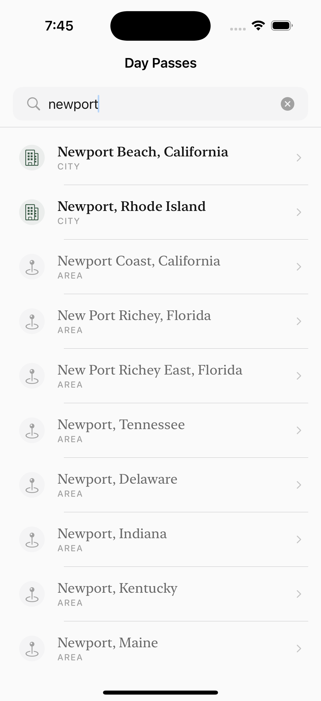
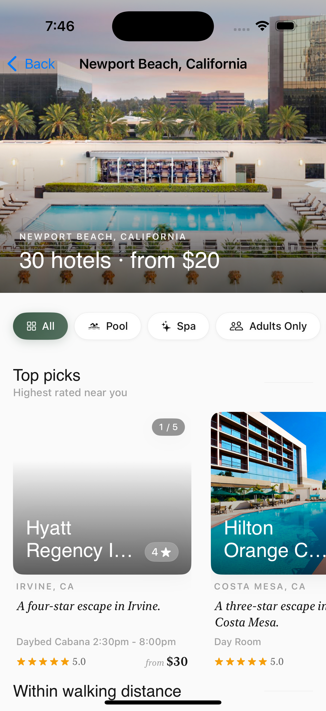
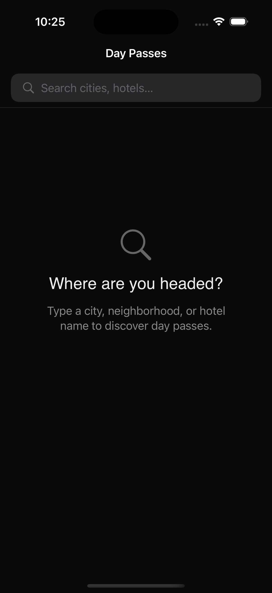
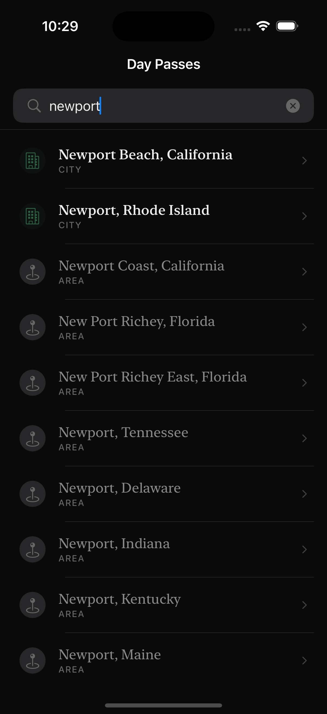
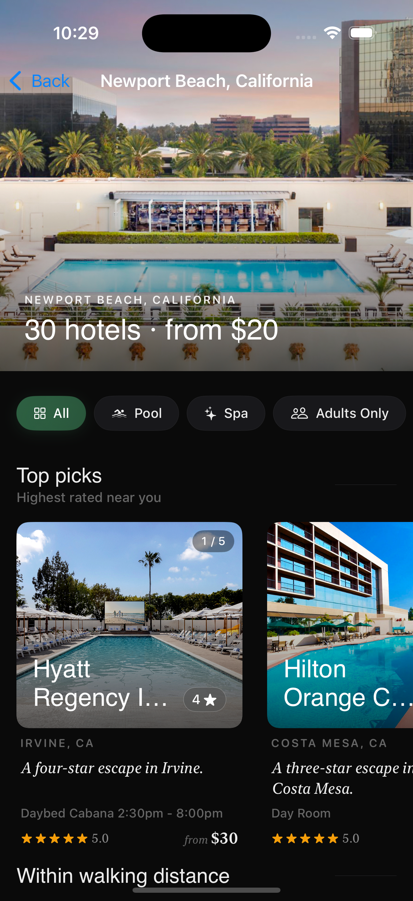

# ResortPass — iOS

Two-screen iOS app for the ResortPass Founding iOS Engineer interview. Search a place, view hotel day passes there. Built with SwiftUI, hand-rolled MVI, and Swift Concurrency against the real staging API.

<sub>iOS&nbsp;17+ · Swift&nbsp;5.9 · 120&nbsp;unit&nbsp;tests · 81&nbsp;Maestro&nbsp;flows · 9&nbsp;ADRs · [CI&nbsp;wired](.github/workflows/ci.yml)</sub>

---

<sub>01 · SETUP</sub>

## Get it running

```bash
git clone <fork-url>
cd ResortPassApp
open ResortPass.xcodeproj
```

`Cmd+R` builds and runs. `Cmd+U` runs the test suite. iOS 17+ Simulator. The `.xcodeproj` is committed alongside its `project.yml`, so reviewers don't need XcodeGen.

```bash
make build    # iPhone 16 Pro / iOS 18
make test     # full unit suite (120 tests, ~20s)
make clean
```

---

<sub>02 · DEMO</sub>

## Both screens, both themes

Real staging API. iPhone 16 Pro / iOS 18.

### Light theme

| Search idle | Search loaded | Hotel listings |
|---|---|---|
|  |  |  |

### Dark theme

| Search idle | Search loaded | Hotel listings |
|---|---|---|
|  |  |  |

### Signature motion

Two animations are easier to feel than describe — the morph from a tapped card into detail, and the parallax response when you pull down the sticky header inside detail. Drop `.mov` / `.mp4` files at `docs/media/morph-transition.mp4` and `docs/media/parallax-hero.mp4` and they auto-embed below.

<video src="docs/media/morph-transition.mp4" controls width="380"></video>
<video src="docs/media/parallax-hero.mp4" controls width="380"></video>

The morph is the iOS 18 zoom transition with an iOS 17 fallback path. The parallax hero stretches via a damped rubber-band response driven by `CADisplayLink` at 120 Hz on ProMotion. If video files aren't present yet, `maestro test .maestro/01-happy-path.yaml` reproduces the morph; `15-swipe-down-dismiss-rubber-band.yaml` exercises the parallax.

---

<sub>03 · TL;DR</sub>

## What this is, in 15 seconds

> **The app.** Two screens: autocomplete search → place selection → hotel listings in sectioned horizontal carousels. Detail screen morphs in from the tapped card and dismisses via a drag-throw spring. Against the real staging API, light + dark, English + Spanish stub.

> **What's notable.** Function-style `Sendable` clients (one-line test swap, no protocol ceremony). A small transport orchestration layer centralizes cross-cutting concerns so feature clients stay ~10 lines. iOS 18 matched-transition-source morph with an iOS 17 fallback. 120 unit tests pin spec compliance + lossy decode behavior; 81 Maestro flows cover state cycles, animation audits, dark mode, AX5, German truncation, VoiceOver, and the launch-arg-injected failure UIs.

> **What didn't ship.** Snapshot testing, pull-to-refresh, pagination, full localization catalogs — all documented in §13–§14 with rough effort estimates.

---

<sub>04 · ARCHITECTURE</sub>

## How it's built

Hand-rolled MVI with `@Observable`. Every feature owns four pieces: a **State** struct with an exhaustive `Status` enum (idle, loading, loaded, empty, failed, plus a feature-specific failure case where it earned one), an **Intent** enum naming every mutation, a `@MainActor` **ViewModel** whose sync reducer is the only thing that mutates state, and a **Client** — a `Sendable struct` whose fields are `@Sendable async throws` closures. Test swap is one-liner; no protocol-conformance ceremony per variant.

```
View → vm.send(.intent) → reducer (sync) → state mutation
                                       └→ Task { client.fetch() } → state mutation on completion
```

The reducer is synchronous and pure. The only side effect is spawning a `Task` for the network call, which checks cancellation at every async seam. A stale-response guard protects against a slow response landing after the user has typed a new query. Cancellation from the system surfaces as `URLError(.cancelled)`; a small translation helper rewrites it to `CancellationError` so view-model catch arms see one uniform shape.

### Networking layer

Two endpoints, one transport seam. A small `HTTPClient` wraps `URLSession` and centralizes status validation + injectable transport (URLProtocol-stubbable for tests). On top of that sits a single transport orchestration helper that owns the cross-cutting concerns each endpoint would otherwise duplicate: structured logging at initiation / completion / failure, post-network and post-decode cancellation checks, decode-error wrapping, URL-level cancellation translation. As a result, the feature clients each read as ~10 lines of code that describe the *what* of the request — build URL, build body, dispatch — and nothing about the *how* of the transport.

The layer is typed end-to-end. Raw HTTP method strings, header names, content types, and log event names are all small enums with helper extensions on `URLRequest`. The POST body for the hotels endpoint is a typed `Encodable` struct, not `[String: Any]` + `JSONSerialization`. Array decoding is lossy by default — one malformed `Place` or `Hotel` row drops to nil without nuking the whole response. Decode errors are wrapped in a domain error variant so the view-model boundary sees a uniform error taxonomy that knows how to classify retryability.

### Navigation

`NavigationStack(path:)` with a value-based `AppDestination` enum. The path is bound to `state.path` via a binding whose setter dispatches a `.pathChanged` intent — pushes and pops both flow through the reducer, preserving the unidirectional invariant. The detail screen uses iOS 18's matched-transition-source + zoom navigation transition as the primary morph; iOS 17 falls back to `matchedGeometryEffect` + a `ZStack` overlay path. Both paths compile against the iOS 17 SDK via an `@available`-gated modifier.

> **Why MVI, not TCA or MVVM.** For two screens, TCA's framework dependency and learning surface didn't justify the cost. MVI captures the same essentials — unidirectional flow, explicit intent enum, replayable transitions, sync reducer, structured concurrency for side effects — without the third-party dependency. MVVM with `@Observable` would also work; I prefer the explicit intent enum because every state mutation becomes discoverable in one place (the reducer's `switch`).

---

<sub>05 · DECISIONS</sub>

## What earned an ADR

Nine decisions warranted a written record. Full text in [`docs/ADRs.md`](docs/ADRs.md).

| | Decision | Why it earned an ADR |
|---|---|---|
| **001** | Hand-rolled MVI, not TCA | Framework cost > value at N=2 screens; unidirectional flow + explicit intent enum capture the essentials without ceremony. |
| **002** | iOS 17 deployment target | Each iOS-17-only API saves 30–60 lines of `#available` branching versus iOS 16. |
| **003** | Function-style clients, not protocols | At N=1 operation per client, protocols add ceremony with no payoff. Includes a 3-way steelman vs the generic-Endpoint approach + a migration sketch past N=4 endpoints. |
| **004** | Sweep I reverted | A "math-equivalent" parallax rewrite interacted badly with `.scaledToFill` on the hero. Honest revert. |
| **005** | Dismiss-no-refetch guard | Status-gated `.appeared` prevents skeleton flash on pop-back from detail; retry stays unconditional. Pinned by a regression test. |
| **006** | Scene-phase staleness — 5 minutes | Balances "briefly switched to Messages" (no refetch) vs "came back hours later" (real stale-data risk). |
| **007** | Value-bound animation, not `PhaseAnimator` | iOS 18 zoom transition re-instantiates the destination view, desyncing the phase index from a preserved `@State` trigger. |
| **008** | Composition-root value bundling all clients | One file, full dependency graph; previews default to fixture clients so they never accidentally hit staging. |
| **009** | Sectioned horizontal carousels for Hotel Listings | Hospitality search is image-led; the spec's vertical list forfeits the curation signal that differentiates a day-pass marketplace. |

---

<sub>06 · FEATURES</sub>

## What each surface owns

### Search

The first screen. An autocomplete search bar at the top, results list below, and three terminal states the user can land in — empty, failed, and a dedicated *null-coordinates* failure for places where the staging API doesn't have lat/lng (Brooklyn, Florida is the canonical example). The 500 ms debounce runs through an injected `ContinuousClock` so tests don't sleep for real wall-clock time. The failure-state CTA is "Search a nearby city" for the null-coord case rather than a generic "Try Again" loop that would re-pick the same offending place.

A Maestro flow caught a real bug here: in landscape, the on-screen keyboard occluded the retry CTA in failed/empty states. Fixed via auto-dismiss of the keyboard on status change.

**Tests:** 11 reducer + 21 spec compliance + 6 direct live-client.

### Hotel listings

The second screen. Above the fold: a parallax stretchy hero, a filter chip row, then sectioned horizontal carousels — `Top picks` (≤5 by rating), `Within walking distance` (≤1.5 mi), `Best value` (cheapest 5), and an `All` fallback. The section pipeline is a pure builder cached on the loaded state; it rebuilds only when hotels or active filter mutate, never per render.

Filters cover All / Pool / Spa / Adults / Pets / Wellness — string-match heuristics against the hotel's product name and primary vibe (the API doesn't expose canonical filter categories). Cache warming runs in two windows: the first 30 cards on `.loaded`, the next four detail-carousel images on card tap.

The deviation from the spec's "vertical list" suggestion lives in [ADR-009](docs/ADRs.md) — full reasoning below in **§12**.

**Tests:** 5 reducer + 11 section-pipeline + 9 direct live-client.

### Hotel detail

A pushed-mode scene that morphs in from the tapped card. iOS 18 path uses matched-transition-source + the system zoom navigation transition; iOS 17 falls back to `matchedGeometryEffect` and a `ZStack` overlay. Both paths compile against the iOS 17 SDK.

The sticky header parallaxes on pull-down (damped scale). Dismiss is a drag-throw with rubber-band response, integrated via `CADisplayLink` to run at the native display refresh — 120 Hz on ProMotion. The image carousel inside uses a peek + mid-snap layout; its caching processor matches the upstream Kingfisher prefetch identifier so the morph never decodes on demand.

---

<sub>07 · DATA</sub>

## Real API quirks worth knowing

Things the staging API does that shaped the model layer:

- The autocomplete response is a **top-level array**, not wrapped in an object.
- Some places (Brooklyn FL is the canonical one) return null lat/lng. Tapping them would send `0,0` to the hotels endpoint and get unrelated results — the VM guards and surfaces a dedicated failure state.
- **Integer `id` collisions are real** — Newport Beach and Newport Coast share `id=236` because Coast is an alias. The model maps `Identifiable.id` to the stable string `objectID` so `ForEach` doesn't silently drop duplicates.
- The hotels response wraps currency as a nested object, encodes images as nested URL records (the decoder picks the largest available), and ships both a human-friendly `rating` and a frequently-zero `avg_rating` — the model uses the former. Cheapest price is computed from the products array.
- **Lossy array decode is the default.** A single malformed row drops to nil rather than nuking the whole response.

---

<sub>08 · CHOICES</sub>

## Technical choices

| Concern | Choice | Why |
|---|---|---|
| **UI framework** | SwiftUI primary, UIKit at 6 specific seams | Spec requires SwiftUI primary; UIKit appears only where SwiftUI doesn't yet reach — status-bar coordination on iOS 17, CoreAnimation-side chip pulse, scale-aware hairlines, the Metal/MPS image grader, and the 120 Hz drag-throw spring. |
| **Concurrency** | `async/await` + `Task` + `ContinuousClock` | Injectable clock makes the 500ms debounce testable without timing flakes. |
| **Networking** | `URLSession` wrapped in a `Sendable` transport seam + one orchestration helper | Two endpoints don't justify Alamofire. The helper centralizes everything cross-cutting. |
| **State management** | Hand-rolled MVI with `@Observable` | See **§4** for the full reasoning. |
| **Dependency Injection** | Manual constructor injection + a composition-root value | One file to read for the full dependency graph. [ADR-008](docs/ADRs.md). |
| **Client shape** | Function-style: `Sendable struct` of `@Sendable` closures | Swap-for-test is one line. [ADR-003](docs/ADRs.md). |
| **Navigation** | `NavigationStack(path:)` with value-based `AppDestination` | Type-safe deep-link surface; mutations flow through the reducer. |
| **Data modeling** | `Codable` with explicit `CodingKeys` | The wire has mixed-case keys; auto-conversion gets it wrong. |
| **Defensive decoding** | Lossy array decode by default | One malformed row drops to nil rather than nuking the response. |
| **Image caching** | Kingfisher 8.x + custom editorial-grade processor (Core Image + Metal/MPS fallback) | Grade runs once per URL, cached on processor identifier. Two cache-warming windows. |
| **Minimum iOS** | 17.0 | Lifted from spec floor of 16 for `@Observable`, `ContentUnavailableView`, value-based path, `ContinuousClock`. [ADR-002](docs/ADRs.md). |
| **Localization** | `String(localized:)` with `defaultValue:` for every user string | Catalog drops in cleanly; Spanish stub exists demonstrating resolution. |

### UIKit drops

Six deliberate seams where UIKit earns its keep:

| Seam | UIKit surface | Why |
|---|---|---|
| Status-bar bridge | `UIHostingController` with `preferredStatusBarStyle` | No native SwiftUI status-bar coordination during morph on iOS 17. Gated to iOS < 18. |
| Transition adapters (4 files) | `UIPresentationController` + percent-driven + animated transitioning | iOS 17 fallback morph scaffolding. |
| Filter-chip pulse | `UIViewRepresentable` over `CALayer` + `CABasicAnimation` | Frame-precise, vBlank-aligned, distinct from SwiftUI's transaction system. |
| Hairline tokens | `UIScreen.main.scale` | Physical-pixel-crisp hairline width. |
| Editorial-grade processor | `UIImage` + Core Image + Metal/MPS | Kingfisher's processor takes `UIImage`. Metal on cache miss; Core Image fallback. |
| Drag-throw spring | `CADisplayLink` | 120 Hz spring integration on ProMotion. [ADR-007](docs/ADRs.md). |

---

<sub>09 · TESTING</sub>

## Verification at two layers

```
unit:    120 tests across 12 files · ~20s · iPhone 16 Pro / iOS 18
maestro: 81 flows · real staging API · launch-arg-injected failure variants
```

**Unit coverage spans** reducer behavior per feature, spec-pinning (500 ms debounce timing, dismiss-no-refetch regression, scene-phase staleness, presentation transitions), URLProtocol-stubbed transport, every URL endpoint vs the spec verbatim (including percent-encoding + CJK), every `URLError` mapping, direct coverage of the live client factories (so the transport orchestration helper is verified end-to-end, not just through the view-model seam), the section-builder pipeline, the logging surface, and real-fixture decoding plus adversarial inputs for both `Place` and `Hotel`.

### Maestro by category

| Band | Count | Coverage |
|---|---|---|
| State cycles | 11 | Happy path, empty/clear/rapid-typing, null-coord guard, CJK input, landscape, failed-then-retry on both endpoints, hotels empty, row-field verification, comprehensive visual audit |
| Animation audits | 10 | Stretchy hero, transitions, morph spring envelope, swipe-down dismiss (rubber-band + commit), search-pill blur, peek carousel mid-snap, filter chip mid-transition, hero pulldown, content fade-in |
| Filter chips | 6 | Spa, Adults, Pets, Wellness, empty result, reset |
| Retry recoveries | 2 | Search and hotels — both exercise the toggle-recovery-on-retry launch arg |
| Loading skeletons | 2 | Search and hotels |
| Dark mode | 10 | All states × both screens × detail expanded × empty filter |
| XXL Dynamic Type | 5 | All states |
| Landscape coverage | 7 | Search and hotels failure/empty states + detail expanded + empty filter |
| German locale | 3 | Long-string truncation verification |
| Orphan-code regression | 4 | Verifies deleted UI surfaces are not mounted |
| Edge cases | 6 | Pull-to-refresh absence, rapid-type-then-clear, debounce collision, offline (search + hotels), slow 3G image loading |
| VoiceOver | 3 | Idle, hotel row, detail close |
| Reduce Motion / Bold Text / Contrast / AX5 | 7 | All major motion + accessibility traits |
| iPad | 2 | Hotels loaded + detail expanded (out of spec but flow-verified) |
| Other | 3 | Coordinate-tap regression (system back button), image-load timing |

Flows use real on-screen text assertions, named screenshot checkpoints, and timeout-bounded waits. The runner exits non-zero on any missed assertion or app crash — the flow IS the test, no separate diff/compare harness is needed. Launch arguments inject failure-state client variants so every error UI is reachable without disrupting the staging API.

### Three real bugs Maestro caught

- **Landscape keyboard occluded the retry CTA** in compact-height layouts. Fixed via auto-dismiss on status change.
- **iOS 26 + Maestro 2.5.1** — the Maestro driver can't walk the iOS 26 SwiftUI accessibility tree (`assertVisible` on body text fails while the app renders identically on iOS 18). Maestro work pinned to iOS 18 sim until upstream resolves.
- **Null-coordinate dead-end** — selecting an alias-only place would otherwise loop the user into a re-failure with no recovery affordance. Pinned by paired happy-path and null-coords flows.

### Snapshot testing

Not implemented in this submission. Listed in **§14** — `swift-snapshot-testing` for the state × portrait/landscape × light/dark matrix would close the visual-regression gap that Maestro's text-assertion model can't directly cover.

---

<sub>10 · AUTOMATION</sub>

## Continuous Integration

GitHub Actions workflow at [`.github/workflows/ci.yml`](.github/workflows/ci.yml). Three jobs:

| Job | Trigger | Duration | Gate |
|---|---|---|---|
| **Unit tests** | Every push + PR | ~5 min | Full 120-test suite on iPhone 16 Pro / iOS 18 |
| **Maestro smoke** | Every push + PR (after unit tests) | ~5–10 min | Five critical flows |
| **Maestro full** | Weekly + manual dispatch | ~30–40 min | All 81 Maestro flows |

xcresult bundles and Maestro screenshots upload as workflow artifacts on failure. Concurrency control cancels in-progress runs when a new commit lands on the same ref. Maestro in CI uses the same fail-on-missed-assertion model as local runs — flows hit the real staging API, so a staging outage will fail CI (accepted trade-off for high-fidelity coverage; flagged in the workflow's top comment).

---

<sub>11 · ACCESSIBILITY</sub>

## Accessibility posture

VoiceOver labels on every interactive element. Hotel cards combine via `.accessibilityElement(children: .combine)` so the rotor reads each card as a single element. Section headers carry the `.isHeader` trait. Dynamic Type respected through `xxLarge` and into accessibility sizes via semantic font styles. Empty + failed states use `ContentUnavailableView` (iOS 17 native, built-in traits). Light/dark mode resolves through Asset Catalog semantic colorsets with both appearance variants. Pinned by dedicated Maestro flows for VoiceOver, AX5, Reduce Motion, Bold Text, and Increase Contrast.

**Honest limitations:** no `AccessibilitySnapshot` integration for label/trait regression catching (deferred); no automated VoiceOver navigation-order tests beyond the Maestro coverage; dark theme contrast not formally WCAG-audited; filter chip and clear-search tap areas are on the HIG 44 pt boundary — flagged for an explicit audit pass.

---

<sub>12 · DEVIATION</sub>

## Hotel listings rendering — deliberate deviation

The interview prompt suggests *"vertical list (e.g., `List` or `LazyVStack` inside a `ScrollView`)"* for Screen 2. This app ships **sectioned horizontal carousels** instead. Three reasons:

- Hospitality search is image-led. Wide, photo-dominant cards in a peek-carousel give every result equal first-class visual real estate — the rhythm of 2026-era travel apps (Airbnb, Hopper, Booking.com).
- Sectioning by editorial axis (`Top picks` / `Within walking distance`) foregrounds curation, which is what differentiates a day-pass marketplace from a generic hotel directory.
- A pure vertical list is the strictly compliant choice; this deviation prioritizes UX impression over verbatim spec adherence, which felt like the right founding-engineer call to surface explicitly.

Each card still surfaces hotel name, image, rating, and price — the spec's *"most relevant product/price information"* — so the information surface matches even when the layout doesn't. Documented in [ADR-009](docs/ADRs.md).

---

<sub>13 · LIMITATIONS</sub>

## Known limitations

- **Pagination** — both endpoints accept `limit` + `offset`; the UI doesn't paginate yet.
- **Pull-to-refresh** on hotel listings is currently disabled (pinned by a Maestro flow that verifies absence).
- **Offline behavior** — no caching of last-seen results; a network drop returns the user to `.failed` without a stale-data fallback.
- **Localization** — plumbing in place; non-English catalogs not yet shipped.
- **Extended product surface** — each hotel has multiple products with tiered prices; the UI shows only the cheapest + top-level product name.
- **App icon + launch screen** — placeholder only.
- **Snapshot testing** — not implemented; deferred to **§14**.
- **iOS 26 + Maestro** — Maestro 2.5.1 can't walk the iOS 26 accessibility tree; Maestro work pinned to iOS 18 sim until resolved upstream.
- **Recording infrastructure** — `simctl recordVideo` is broken on the current Xcode toolchain; the morph + parallax videos in **§2** require QuickTime manual recording until that lands upstream.

---

<sub>14 · NEXT</sub>

## With more time

Ordered roughly by interview-lens value-per-hour:

1. **Pull-to-refresh + pagination** on hotel listings via `refreshable {}` + offset bumping, with VM state for `loadingMore` and an infinite-scroll trigger threshold. ~2–3 h.
2. **Snapshot test suite** — `swift-snapshot-testing` across every state × Search/Listings × portrait/landscape × light/dark. `AccessibilitySnapshot` on top for label/trait regressions. ~3–4 h.
3. **Migration past N=4 endpoints** — generic `Endpoint<Response>` + single dispatcher (sketched in [ADR-003](docs/ADRs.md)). Centralizes retry, auth, telemetry. Not protocols.
4. **Swift 6 typed throws** at the client signatures so the error taxonomy is encoded in the type system rather than via downcasts.
5. **`AsyncSequence` debounce** via Async Algorithms instead of imperative `Task` + clock sleep.
6. **Maestro device matrix in CI** — iPhone SE / 15 / 17 Pro Max × portrait/landscape × themes on PRs.
7. **Snapshot regression in CI** — fourth workflow job with diff images uploaded as artifacts.
8. **Recording-factory logger** so unit tests can assert on logger emissions per status transition.
9. **Pre-commit hooks** (SwiftFormat or SwiftLint) so conventions don't drift.
10. **Localization catalogs** for at least Spanish and French.
11. **Performance traces** for the morph hot path (Instruments + a target frame budget pinned in CI).
12. **iOS 26 retest** once Maestro fixes the accessibility-tree gap.
13. **Video recording workaround** — QuickTime or `ffmpeg avfoundation` so the demo videos ship as real motion.

---

<sub>15 · LAYOUT</sub>

## Project layout (reference)

```
Sources/
├── App/                       @main + composition root + iOS 17 morph adapters + status-bar bridge
├── Models/                    Place · Hotel · Currency (+ preview fixtures in their own files)
├── Networking/                Transport seam + orchestration helper + typed HTTP primitives + Codable bodies + lossy decoding + error taxonomy + actor-backed test counter
├── Features/
│   ├── Search/                State + Intent + ViewModel + View
│   ├── HotelListings/         Same shape, plus the section-builder pipeline
│   └── HotelDetail/           Pushed-mode scene + CADisplayLink drag-throw
├── DesignSystem/              Two-tier design tokens (palette → theme) + reusable components
├── ImageCaching/              Kingfisher wrapper + editorial-grade processor (Metal/MPS)
├── Logging/                   Function-style logger + typed event names
├── Routing/                   Single value-based destination enum
├── Strings/                   `String(localized:)` namespace + per-feature error-message factories
└── Resources/                 Asset catalog (light/dark semantic colorsets, fonts, icons)

Tests/
├── Per-feature ViewModel tests        Reducer behavior
├── SpecComplianceTests                Spec-pinning (debounce, dismiss-no-refetch, staleness, transitions)
├── Live-client tests                  Direct .live factory coverage via stubbed transport
├── Transport + endpoints + constants  URLProtocol-stubbed transport, URL spec pins, boundary constants
├── Section-builder + logging + decoders   Pipeline pins, logging surface, defensive Codable
└── Fixtures/                          Real staging JSON for decoder tests
```

---

<sub><a href="ARCHITECTURE.md">ARCHITECTURE.md</a> · <a href="docs/ADRs.md">docs/ADRs.md</a> · <a href=".github/workflows/ci.yml">CI workflow</a> · <a href=".maestro/">Maestro flows</a></sub>
