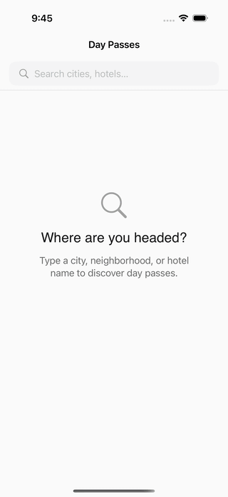

# ResortPass — iOS

> Two-screen iOS app for the ResortPass Founding iOS Engineer interview.
> Search a place, view hotel day passes there. SwiftUI, hand-rolled MVI, Swift Concurrency.

<sub>iOS&nbsp;17+&nbsp;·&nbsp;Swift&nbsp;5.9&nbsp;·&nbsp;120&nbsp;unit&nbsp;tests&nbsp;·&nbsp;81&nbsp;Maestro&nbsp;flows&nbsp;·&nbsp;9&nbsp;ADRs</sub>

---

## Setup

```bash
git clone <fork-url>
cd ResortPassApp
open ResortPass.xcodeproj
```

`Cmd+R` to build and run. `Cmd+U` to run the test suite. No additional tooling needed — the `.xcodeproj` is committed alongside the `project.yml` it was generated from, so reviewers don't need XcodeGen installed.

For the engineer's local convenience:

```bash
make build    # xcodebuild for iPhone 16 Pro / iOS 18
make test     # full unit suite (120 tests, ~20s)
make clean    # nuke DerivedData
```

---

## Demo

<table>
<tr>
<td align="center"></td>
<td align="center"></td>
</tr>
<tr>
<td align="center"><sub>Search → typing → loaded → tap → hotels</sub></td>
<td align="center"><sub>Same flow, dark appearance</sub></td>
</tr>
</table>

<details>
<summary>Still frames at each step (light + dark)</summary>

<br/>

<table>
<tr>
<td align="center" colspan="3"><sub>Light</sub></td>
</tr>
<tr>
<td></td>
<td></td>
<td></td>
</tr>
<tr>
<td align="center" colspan="3"><sub>Dark</sub></td>
</tr>
<tr>
<td></td>
<td></td>
<td></td>
</tr>
<tr>
<td align="center"><sub>idle</sub></td>
<td align="center"><sub>loaded</sub></td>
<td align="center"><sub>hotels</sub></td>
</tr>
</table>

</details>

<sub>GIFs are slow-motion screenshot sequences captured via Maestro (<code>.maestro/recordings/capture-sequence.yaml</code>) + <code>ffmpeg</code>. The animated morph spring and drag-throw dismiss aren't reproducible as still-frame stitches — see <a href="docs/media/README.md"><code>docs/media/README.md</code></a> for the recording infrastructure note and how to re-record locally.</sub>

---

## At a glance

- **Two screens, real staging API.** Autocomplete search → place selection → hotel listings with sectioned carousels.
- **MVI without a framework.** `@Observable` state, `Intent` enum, sync reducer, side effects in structured `Task`s.
- **Function-style clients.** `Sendable struct` of `@Sendable async throws` closures — swap-for-test in one line, no protocol ceremony. See [ADR-003](docs/ADRs.md) for the protocol-vs-function-style decision.

---

## Architecture

```mermaid
flowchart LR
    V[View<br/><sub>SwiftUI</sub>] -->|reads| S[@Observable State]
    V -->|send Intent| VM[ViewModel<br/><sub>@MainActor</sub>]
    VM -->|mutates| S
    VM -->|spawns Task| C[Client<br/><sub>Sendable struct</sub>]
    C -->|executeJSON| H[HTTPClient]
    H -->|data for:| U[URLSession]
    U -.->|response| H
    H -.->|decoded| C
    C -.->|domain types| VM
```

The reducer is **synchronous and pure**. The only side effect is spawning a `Task` for the network call. Every async path checks `Task.checkCancellation()` at the seams. Cancellation propagates from VM → URLSession (via stored `Task<Void, Never>?` handle) and back as `CancellationError`.

<details>
<summary><b>Why MVI, not TCA or MVVM</b></summary>

For a 2-day take-home with two screens, TCA's framework dependency and learning surface didn't justify the cost. MVI captures the same essentials — unidirectional flow, explicit `Intent` enum, replayable transitions, sync reducer, structured concurrency for side effects — without the third-party dependency. MVVM with `@Observable` would also have worked, but the explicit `Intent` enum makes every state mutation discoverable in one place (the reducer's `switch`), which I prefer for testability and onboarding.

</details>

<details>
<summary><b>State management + cancellation propagation</b></summary>

```
View → vm.send(.intent) → reducer (sync) → state mutation
                                       └→ Task { client.fetch() } → state mutation on completion
```

Every `startSearch` cancels the previous `fetchTask` before assigning a new one. The task body uses `try Task.checkCancellation()` after the debounce sleep **and** after the network call. The stale-response guard (`guard query == state.query.trimmingCharacters(in: .whitespaces)`) protects against a slow response landing after the user has typed a new query.

Cancellation taxonomy: `URLSession` raises `URLError(.cancelled)` when its task is cancelled; the transport layer translates that to `CancellationError()` via `Error.translatingCancellation()` so the VM's catch arms see one uniform shape.

</details>

<details>
<summary><b>The <code>executeJSON</code> transport helper</b></summary>

`HTTPClient.executeJSON<T>(_:as:event:payload:logger:)` owns the cross-cutting concerns that previously lived inside each feature client's `.live` closure: log-initiated, send, check cancellation, decode, check cancellation again, log-completed, translate URL-level cancellation, wrap `DecodingError` in `NetworkingError.decode`, log-failed.

Result: `SearchClient.live` and `HotelsClient.live` closures collapsed from ~25 and ~40 lines respectively to ~10 and ~15 lines — and adding endpoint #3 doesn't repeat any of these concerns. See [`Sources/Networking/HTTPClient.swift`](Sources/Networking/HTTPClient.swift).

</details>

---

## Features

<table>
<tr><th align="left">Feature</th><th align="left">Key files</th><th align="left">Notable choice</th></tr>

<tr>
<td><b>Search</b><br/><sub>autocomplete + debounce</sub></td>
<td><a href="Sources/Features/Search/">Sources/Features/Search/</a><br/><a href="Sources/Networking/SearchClient.swift">SearchClient.swift</a></td>
<td>500ms debounce via injected <code>ContinuousClock</code> — testable, no sleep-flakes. Null-coord guard surfaces a dedicated <code>.failedNullCoords</code> state with a recovery CTA instead of trapping the user in a retry loop.</td>
</tr>

<tr>
<td><b>Hotel listings</b><br/><sub>sectioned carousels</sub></td>
<td><a href="Sources/Features/HotelListings/">Sources/Features/HotelListings/</a><br/><a href="Sources/Networking/HotelsClient.swift">HotelsClient.swift</a></td>
<td>Top picks · Walking distance · Best value · All — pure section builder, recomputed only when <code>hotels</code> or <code>activeFilter</code> changes. Deviates from the spec's vertical list <a href="#hotel-listings-rendering--deliberate-deviation">on purpose</a>.</td>
</tr>

<tr>
<td><b>Hotel detail</b><br/><sub>morph + drag-throw</sub></td>
<td><a href="Sources/Features/HotelDetail/">Sources/Features/HotelDetail/</a></td>
<td>iOS 18 path uses <code>.matchedTransitionSource</code> + <code>.navigationTransition(.zoom)</code>; iOS 17 fallback uses <code>matchedGeometryEffect</code> + <code>ZStack</code> overlay. Drag-throw dismiss is driven by a <code>CADisplayLink</code> spring integrator for 120 Hz ProMotion alignment.</td>
</tr>

</table>

---

## What Maestro caught for us

Maestro flow-level testing isn't decorative here. Three real bugs it surfaced that unit tests couldn't:

#### F12-05 — Landscape keyboard occluded the retry CTA

`.maestro/06-landscape.yaml` flagged that in compact-height layouts, the on-screen keyboard hid the "Try Again" button in `.failed` / `.empty` states. Fix: `.scrollDismissesKeyboard(.immediately)` on the search view + `onChange(of: state.status)` to resign first responder when entering those statuses. The fix and reasoning live in `SearchView.swift:24-36`.

#### iOS 26 + Maestro 2.5.1 — empty accessibility tree

`assertVisible: "Where are you headed?"` failed on iOS 26.4 but passed on iOS 18 with the same build. Investigation: Maestro 2.5.1 cannot walk the iOS 26 SwiftUI accessibility hierarchy — every body `Text` view is missing from the tree, only navigation chrome reaches the assertion layer. Visually the app renders identically on both. **Tooling pin: target iPhone 16 Pro / iOS 18 for all Maestro work** until Maestro ships iOS 26 support.

#### Null-coordinate dead-end

`01-happy-path.yaml` + `05-null-coords-guard.yaml` together pinned that selecting "Brooklyn, Florida" (lat/lng `null` in the API) surfaces the dedicated `.failedNullCoords` state with a "Search a nearby city" CTA — **not** a generic "Try Again" loop that would re-pick the same offending place. The original behavior would have looked harmless in code review and would have shipped.

<details>
<summary><b>How Maestro is wired in this project</b></summary>

**~80 flows** in `.maestro/` cover happy paths, empty/error/failed-then-recovers, debounce timing, cancellation, dark mode (`xcrun simctl ui booted appearance dark` before run), landscape rotation, AX5 Dynamic Type, scene-phase staleness, retry recovery.

**Launch-arg-injected client variants** in `ResortPassApp.init` — `--ui-test-fail-search`, `--ui-test-empty-hotels`, `--ui-test-toggle-recovery-on-retry`. Maestro exercises every failure UI without disrupting staging.

**Assertion model.** Flows use `assertVisible:` against real on-screen text the user sees, `extendedWaitUntil:` with timeouts for async UI, and `takeScreenshot:` at named checkpoints. There's no separate "compare against expected output" infrastructure — Maestro's runner fails the flow if any assertion misses or the app hangs / crashes. Simple, sufficient at this scale.

**Run locally:**

```bash
export JAVA_HOME=/opt/homebrew/opt/openjdk@17/libexec/openjdk.jdk/Contents/Home
maestro test .maestro/01-happy-path.yaml          # one flow
maestro test .maestro/                            # the full ~80
```

</details>

---

## Decisions

The architectural choices that warrant defending. Each links to its ADR.

| | Decision | One-liner |
|---|---|---|
| [ADR-001](docs/ADRs.md) | Hand-rolled MVI, not TCA | Framework cost > value at N=2 screens |
| [ADR-002](docs/ADRs.md) | iOS 17 deployment target | `@Observable` + `ContentUnavailableView` + `ContinuousClock` justify dropping iOS 16 |
| [ADR-003](docs/ADRs.md) | Function-style clients, not protocols | `Sendable struct` of `@Sendable` closures — see [the steelman](docs/ADRs.md) |
| [ADR-005](docs/ADRs.md) | Dismiss-no-refetch guard | Status-gated `.appeared` prevents skeleton flash on pop-back |
| [ADR-006](docs/ADRs.md) | 5-minute scene-phase staleness | Balance brief-background vs hours-background refresh |
| [ADR-007](docs/ADRs.md) | Value-bound animation, not `PhaseAnimator` | Re-instantiation during morph re-sets phase index; value-binding survives |
| [ADR-008](docs/ADRs.md) | `AppDependencies` composition root | One file, full dependency graph |
| [ADR-009](docs/ADRs.md) | Sectioned carousels (Screen 2 deviation) | Hospitality search is image-led |

---

## Testing

```
unit:    120 tests · ~20s · iPhone 16 Pro / iOS 18
maestro:  81 flows · against the live staging API
```

<table>
<tr><th align="left">Suite</th><th align="left">Count</th><th align="left">What it pins</th></tr>
<tr><td><code>SearchViewModelTests</code></td><td>11</td><td>Reducer behavior — every status transition, debounce, cancellation, stale-response guard</td></tr>
<tr><td><code>HotelListingsViewModelTests</code></td><td>5</td><td>Fetch lifecycle, retry, location-routing</td></tr>
<tr><td><code>SpecComplianceTests</code></td><td>21</td><td>Interview-spec pinning: 500ms debounce timing, dismiss-no-refetch, scenePhase staleness, presentation transitions</td></tr>
<tr><td><code>HTTPClientTests</code></td><td>7</td><td>URLProtocol-stubbed transport: status mapping, non-HTTP, network unavailable, cancellation cascade</td></tr>
<tr><td><code>NetworkingLayerTests</code></td><td>18</td><td><code>Endpoints</code> URL verbatim vs spec (incl. CJK + percent-encoding) + every <code>ErrorKind</code> mapping</td></tr>
<tr><td><code>NetworkingConstantsTests</code></td><td>7</td><td>Direct pins for <code>successStatusRange</code> boundaries, <code>requestTimeout</code>, page sizes</td></tr>
<tr><td><code>SearchClientLiveTests</code></td><td>6</td><td>URL build, lossy decode, error propagation, cancellation translation against the actual <code>.live</code> factory</td></tr>
<tr><td><code>HotelsClientLiveTests</code></td><td>9</td><td>Body shape against actual client, POST + Content-Type, wire-to-domain mapping, fallbacks</td></tr>
<tr><td><code>LogClientTests</code></td><td>3</td><td><code>.silent</code> discards, custom factory captures, <code>LogEvent</code> overload dispatch</td></tr>
<tr><td><code>HotelListingsSectionsTests</code></td><td>12</td><td>Section pipeline: top-picks cap, walking ≤ 1.5mi boundary, best-value ordering, fallback All</td></tr>
<tr><td><code>PlaceTests</code></td><td>15</td><td>Decoding real Newport/Brooklyn fixtures + adversarial inputs + <code>FailableDecodable</code> lossy coverage</td></tr>
<tr><td><code>HotelTests</code></td><td>6</td><td>Custom decoder coverage + Codable round-trip</td></tr>
</table>

**Maestro coverage matrix.** Happy paths · empty/error/failed-then-recovers · debounce/cancellation · null-coord guard · CJK search · dark mode · landscape · AX5 Dynamic Type · scene-phase staleness · retry recovery · filter chips · transitions audit.

---

## Continuous Integration

GitHub Actions workflow at [`.github/workflows/ci.yml`](.github/workflows/ci.yml). Three jobs:

| Job | Runs on | Duration | Gate |
|---|---|---|---|
| **`unit-tests`** | Every push + PR | ~5 min | Full 120-test suite on iPhone 16 Pro / iOS 18 sim |
| **`maestro-smoke`** | Every push + PR | ~5–10 min | Critical flows: `01-happy-path`, `06-landscape`, `02-search-empty`, `09-hotels-empty`, `07-search-failed-retry` |
| **`maestro-full`** | Weekly + manual dispatch | ~40 min | All ~80 Maestro flows |

Maestro screenshots and `xcresult` bundles upload as workflow artifacts on failure for inspection.

> **Note on Maestro in CI.** Flows assert against real on-screen text + named screenshots — Maestro's runner fails the flow if any assertion misses or the app crashes/hangs. No separate output-comparison infra is needed; the flow IS the test. Flows hit the real staging API, so a staging outage will fail CI — acceptable trade-off, flagged in the workflow's top comment.

---

## API quirks worth knowing

The staging API has a few real-world rough edges that shaped the model layer:

- **Autocomplete is a top-level array** — not wrapped in `{"results": [...]}`. `Decoders.api.decodeLossy([Place].self, from: data)` handles it directly.
- **Some places have `latitude: null, longitude: null`** (e.g. "Brooklyn, Florida"). Tapping such a place would send `0,0` to the hotels endpoint and get unrelated results. `Place.hasUsableCoordinates` + the VM guard + a dedicated `.failedNullCoords` state surface the dead-end honestly.
- **Integer `id` collisions.** Newport Beach and Newport Coast both have `id=236` because Coast is an alias. `objectID` (denormalized string key) is stable; `Place.id` (Identifiable) maps to it so `ForEach` doesn't silently drop duplicates.
- **Hotel response shape.** `currency` is a nested object; `image[]` is an array of nested `picture.url` objects; both `rating` (human-friendly) and `avg_rating` (often 0.0) ship — the decoder uses `rating`. Cheapest price is `products[].price.min()`.
- **Lossy array decode by default.** `FailableDecodable<T>` lets one bad row drop without nuking the rest of the response. Pinned by `PlaceTests.test_decodeLossy_*` and `HotelsClientLiveTests.test_search_dropsOneMalformedHotelKeepsRest`.

---

## Hotel listings rendering — deliberate deviation

The interview prompt suggests *"vertical list (e.g., `List` or `LazyVStack` inside a `ScrollView`)"* for Screen 2. This app ships **sectioned horizontal carousels** instead. Three reasons:

- Hospitality search is image-led. Wide, photo-dominant cards in a peek-carousel give every result equal first-class visual real estate — the rhythm of 2026-era travel apps (Airbnb, Hopper, Booking.com).
- Sectioning by editorial axis (`Top picks` / `Within walking distance`) foregrounds curation — what differentiates a day-pass marketplace from a generic directory.
- A pure vertical list is the strictly compliant choice; this deviation prioritizes UX impression over verbatim spec adherence, which felt like the right founding-engineer call to surface explicitly.

Each card surfaces hotel name, image, rating, and price — the spec's *"most relevant product/price information"* — so the information surface matches even when the layout doesn't. Documented in [ADR-009](docs/ADRs.md).

---

## Project structure

```
Sources/
├── App/                            @main + composition root + UIKit transition adapters
├── Models/                         Place · Hotel · Currency · *+PreviewFixtures
├── Networking/                     HTTPClient · executeJSON · *Client · Endpoints · Codable
├── Features/
│   ├── Search/                     State + Intent + ViewModel + View
│   ├── HotelListings/              State + Intent + ViewModel + View
│   └── HotelDetail/                Pushed-mode scene + drag-throw spring
├── DesignSystem/                   Theme tokens + reusable components
├── ImageCaching/                   Kingfisher wrapper + EditorialGradeProcessor
├── Logging/                        LogClient + LogEvent
├── Routing/                        AppDestination
└── Resources/                      Assets.xcassets (incl. colorsets)

Tests/
├── *ViewModelTests.swift           Reducer behavior per feature
├── SpecComplianceTests.swift       Interview-spec pinning
├── *ClientLiveTests.swift          Live factory coverage (URL build, decode, errors)
├── HTTPClientTests.swift           URLProtocol-stubbed transport
├── NetworkingConstantsTests.swift  Direct constant pins
├── HotelListingsSectionsTests.swift  Section builder pipeline
├── LogClientTests.swift            Logging surface
├── PlaceTests.swift / HotelTests.swift  Decoder coverage
└── Fixtures/                       Real staging JSON for decoder tests
```

---

## UIKit drops

<details>
<summary>SwiftUI-primary with 6 deliberate UIKit seams — click to expand</summary>

<br/>

| File | UIKit surface | Why |
|---|---|---|
| `App/StatusBarBridgeHostingController.swift` | `UIHostingController` exposing `preferredStatusBarStyle` | iOS 17 has no native SwiftUI API to coordinate the status bar with a morph; iOS 18 `.zoom` handles it natively. Gated to `iOS < 18`. |
| `App/Transitions/Morph*.swift` (4 files) | `UIPresentationController` + `UIPercentDrivenInteractiveTransition` | Scaffolded for the iOS 17 fallback morph. Not currently consumed at runtime (iOS 18 `.zoom` is primary). Retained as belt-and-suspenders per [ADR-009](docs/ADRs.md). |
| `DesignSystem/Components/FilterChipRow.swift` | `UIViewRepresentable` wrapping `CALayer` | `CABasicAnimation` runs CoreAnimation-side (frame-precise, vBlank-aligned) — used for a single-frame border-width pulse that reads as a confirmation ring. |
| `DesignSystem/Tokens/Theme.swift` | `UIScreen.main.scale` for `Theme.Spacing.hairline` | Physical-pixel-crisp hairline width. SwiftUI has no universally-accessible `displayScale` equivalent for tokens. |
| `ImageCaching/EditorialGradeProcessor.swift` | `UIImage` + `MTKTextureLoader` + Core Image / MPS | Runs the editorial grade (saturation, contrast, warm shift) on cache-miss. CoreImage path + Metal/MPS fallback both present. |
| `Features/HotelDetail/HotelDetailScene.swift` | `CADisplayLink` snap-back driver | Drag-throw rubber-band interpolates at the native display refresh (120 Hz on ProMotion). |

</details>

---

## Accessibility

VoiceOver labels on every interactive element. Hotel cards combine via `.accessibilityElement(children: .combine)` so the rotor reads each as a single element. Section headers carry `.isHeader`. Dynamic Type respected through `xxLarge` and into accessibility sizes via semantic font styles. `ContentUnavailableView` for empty + failed states (native iOS 17 component with built-in traits). Light/dark via Asset Catalog colorsets with `Any` + `Dark` appearance variants.

<details>
<summary>Touch-target audit + honest limitations</summary>

<br/>

**Marginal targets** (informal audit — no AccessibilityInspector run):

- Filter chip tap area is ~32pt before padding lifts it to ~44pt, on the HIG minimum boundary.
- Clear-search button's icon is ~12pt but its containing button extends to ~30pt — also marginal.

Both flagged for an explicit audit pass.

**Honest limitations:**

- No AccessibilitySnapshot integration (label/trait regression catching).
- No automated VoiceOver navigation order tests.
- AX5 (largest Dynamic Type size) verified visually via Maestro flow `76-AX5-search-idle.yaml` only.
- Dark theme contrast not WCAG-AA audited; light theme is.

</details>

---

## Known limitations

- **Pagination** — both endpoints accept `limit` + `offset`; the UI doesn't paginate yet. Infinite scroll on hotels would be a natural addition.
- **Pull-to-refresh** on hotel listings.
- **Offline behavior** — no caching of last-seen results; a network drop returns the user to `.failed` without stale-data fallback.
- **Localization** — every user string is wired through `String(localized:)` with `defaultValue:` (~30 calls). Non-English catalogs not yet shipped.
- **Extended product surface** — each hotel has multiple products + price tiers; the UI shows the cheapest price + top-level product name only.
- **App icon + launch screen** — placeholder `Contents.json` only.

---

## With more time

Ordered roughly by interview-lens value-per-hour:

1. **Pull-to-refresh + pagination** on hotel listings via `refreshable {}` + offset bumping. Tests: VM state for `.loadingMore`, infinite-scroll trigger threshold, end-of-results signal. ~2–3 h.
2. **Snapshot test suite** — `swift-snapshot-testing` across `idle / loading / loaded / empty / failed` × Search + Listings × portrait/landscape × light/dark = ~40 baselines. `AccessibilitySnapshot` for label/trait regression catching on top. ~3–4 h.
3. **Migration past N=4 endpoints** — generic `Endpoint<Response>` + `APIClient.send(_:)` dispatcher (sketched in [ADR-003](docs/ADRs.md)). Centralizes retry, auth, telemetry. Not protocols — those don't fix the right problem.
4. **Swift 6 typed throws** — `func search(_:) async throws(SearchError) -> [Place]` so `ErrorKind.from` doesn't need downcasts.
5. **`AsyncSequence` debounce** via Async Algorithms (vs current imperative `Task` + `clock.sleep`). Replaces the existing 500ms guard with a more declarative stream.
6. **Maestro matrix** across iPhone SE / 15 / 17 Pro Max + portrait/landscape + light/dark. Currently only iPhone 16 Pro / portrait / both themes are exercised. Wire matrix configs in CI's `maestro-full` job.
7. **Snapshot test integration in CI** — Job 4: snapshot regression on PRs, with diff images uploaded as artifacts.
8. **`LogClient.recording` factory** that buffers calls so unit tests can assert on logger emissions per Status transition.
9. **Pre-commit hooks** (SwiftFormat or SwiftLint) so conventions documented here can't drift.
10. **Localization catalogs** for at least Spanish and French — the `String(localized:)` plumbing is in place, only `.xcstrings` data missing.
11. **VoiceOver flow tests** — automated navigation-order checks beyond labels.
12. **Performance traces** for the morph hot path (Instruments time-profile + a target frame budget pinned in CI).
13. **Hotel detail edge cases** — long product names, missing imagery, products-with-no-price.
14. **iOS 26 retest** once Maestro fixes the accessibility-tree gap documented above.

---

<sub>Architecture conventions: <a href="ARCHITECTURE.md">ARCHITECTURE.md</a> · Major design decisions: <a href="docs/ADRs.md">docs/ADRs.md</a></sub>
